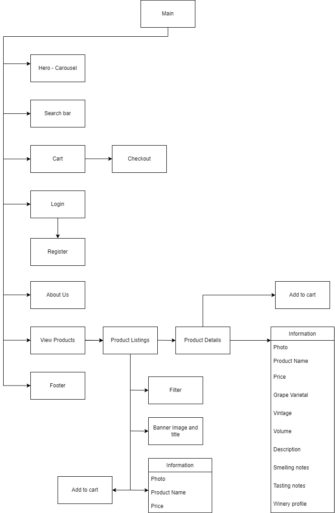

# Project 3 - Frontend

[Trent Global College](https://www.trentglobal.edu.sg/)
 * Software Development BootCamp
 * Diploma in Web Application Development
 * Project 3

The live demo can be found at [https://cinq-a-sept.netlify.app](https://cinq-a-sept.netlify.app/).

Backend repository is [here](https://github.com/caracara6/tgc16-p3-be).

## Summary

**Context**
Cinq a Sept - 5 to 7 in French - is a mobile-responsive online e-commerce platform retailing wine. Customers can shop for wine and tailor their search according to wine-specific criteria, such as type of wine, region, origin country, and vintage. The target market includes wine afficionados, wine-lovers, and wine-drinkers in general. The site is simple to use and maintain, and this facilitates sales and profit for the site owner.

## UI/UX

### **Strategy**

_Organisation_
* Objective: Maximise sales and profit through an easy-to-browse online ecommerce store, continuously stock and introduce fine and reknowned wines from all over the world to consumers in Singapore, contribute to the local wine community by exposing consumers to global wine discoveries

_User_
* Objective: Search for wine easily by name, relevant keywords, and tasting and olfactory notes, filter by wine-specific criteria such as country of origin, region produced, wine vintage, type of wine (e.g. red, wine, sparkling), and also general criteria such as price range, easy-checkout with an online payment system that accepts credit cards, easy adding to and storing in cart
 

* Needs: Platform with simple features such as checkboxes and dropdowns which allows for easy search and browse, clear information about product provided
 

* Demographics:
    * Wine drinkers in general of legal drinking age
    * Consumers who may be seeking suitable wine for various events
    * Wine connoisseurs/returning customers who have a thorough understanding of wine and know what they want
 

* Pain point: Wine bottles are heavy to carry if purchasing from a physical store, thus would be much more convenient if delivered and purchased from an online store which includes information about the wine in detail
 

User Stories | Acceptance Criteria
------------ | -------------------
As a regular wine-drinker who is seeking an online store to purchase wine from, I want to be able to easily explore and locate the type of wine I have in mind. | Simple-to-use interface with multiple search-filtering functions(including by wine name, wine region, country of origin, price range, type of wine, and wine vintage) which allows users to narrow down their search with ease.
As a consumer/wine-drinker who is curious about what certain wines taste like, in order to determine a good pairing with food dishes, I want to be able to retrieve information about tasting and smelling notes in order to facilitate my decision-making. | Comprehensive information about the wine's description and nose and mouth attributes, provides ample information for consumer to select the best-pairing wine for whichever occasion.
As the owner of the online store, I wish to have an easy-to-navigate website for consumers to have a seamless shopping experience and thus maximise profits for me. | Multiple call-to-action features throughout the website prompting more purchases. 

### **Scope**
_Functional Requirements_
* Owner is able to post new wine listings, update current listings, post and update secondary but relevant information such as origin countries and grape varietals, delete sales listings if wish to. Orders which are made on the ecommerce site are automatically deducted from the inventory and removed from the consumer's cart, which relieves the owner from having to do so manually.

* Admin site allows for creating a new account in order to do the above-mentioned.

* Consumers can create an account via the ecommerce site, but this account will not be able to access the admin site, to prevent consumers from tampering with sensitive information. 

* On the ecommerce site, consumers are able to view all listings on one page, and opt to view all information about a specific listing (master details view). Consumers can bookmark relevant pages(with the help of React Router) or add specific products to cart(which will be stored in local storage and retrieved the next time they access the website).

* Consumers who log in into their accounts on the ecommerce site are able to make purchases via Stripe checkout. 

_Content Requirements_
* Content requirements for customers include providing their email, password, and name when signing up for an account. Content requirements for admin when posting a new sales listing include name, grape varietals, price, stock, winery, size, photo. 

_Non-functional requirements_
* Mobile responsiveness
    * Achieved by employing Bootstrap components and CSS
* Multi-page application with master details view

### **Structure**

Mockup wireframes can be found [here](https://miro.com/app/board/uXjVO0kP2Mc=/?share_link_id=937932661196).

### **Skeleton**

_Colour Palette_

Colour palette can be found [here](https://coolors.co/eae8ff-2d232e-fafafa-d6d6d7).

Hex #eae8ff and #d6d6d7 were chosen to represent the tranparency of glass. The majority of the app is decked out in monochrome colours in order to allow the colours of the wine/wine bottles to pop.

_Font Choices_

The font choice is [Montserrat](https://fonts.google.com/specimen/Montserrat?query=mont), a clean and modern sans serif font. This allows for easy readability and gives an overall polished finish.

_Layout_

The product details page transforms from single-column for mobile devices to dual-column for laptop-sized devices. This allows for better use of white space. 

## Features
1. **Users can search through the sales listings.** 
The search modal allows users to search by text, and filters through multiple entry fields in the backend. Other search filters include type of wine, country of origin, wine-producing region, wine vintage, and price range. These are constructed with dropdowns and checkboxes. 

2. **Users can add listings to cart.**
The detailed individual product page is where the add-to-cart call-to-action is located. Users can also toggle the quantity buttons to add a specific number of a product to the cart. Both users without accounts and users with accounts can add listings to their cart.

3. **Users can checkout using Stripe payment gateway.**
Should users choose to checkout with their cart items, assuming no discrepencies with the inventory, they will be redirected to the Stripe checkout page detailing their cart items and related quantities. Here, users can input their email, name, address, and payment information. If payment is successful, they will again be redirected back to the ecommerce site with a message confirming their purchase. Their cart items will also be removed. If they choose not to checkout, they will be redirected back to the ecommerce site's landing page.

4. **Admin can do CRUD - create, read, update, delete - for product listings**
On the admin site, admin can add new product listings and relevant wine-specific information. Fields include name, description, taste and smell attributes, winery, grape varietals, vintage. Admin can also update information about the products, for e.g. new stock or a change in price.

_Limitations and future implementations_

Due to the time limitation of this project, certain features have yet to be developed. This includes sorting, pagination, and autocomplete.

Users are currently unable to view their orders, as well as do CRUD on their account information. Plans in future include implementing this feature for users to change their account information.

Some comments in the code have not been removed prior to project submission as I intend to work on this in future.

## Testing

Description | Steps | Expected Result
----------- | ----- | ---------------
Viewing all wine product listings | On the landing page, there are three carousel images, each containing a link to the product-listings page. User clicks on one of these links. | Clicking on each of these links will bring the user to the product-listings page. 
Viewing a specifc category/type of wine | On the header, user can select from a dropdown which lists the specific type of wine(red, white, rose, champagne, and sparkling). User clicks onto one of these categories | User will be brought to the page with the selected type of wine
Search using keyword | User clicks on the search icon on the header | A modal with a textbox will appear, and users can search using keywords. Upon submitting the search request, the modal will close and user will be redirected to the product-listings page containing relevant search results.
Narrow search using checkboxes | On the product-listings page, there are checkboxes which allows user to filter their search by wine-producing region, country of origin, wine vintage, and price range. | Users can select these checkboxes and the listings will change according to whichever fits the selected criteria.
View details about a specific product | User clicks on a specific listing | User will be directed to the page containing details about the specific product
Add to cart | On the specific product page, user clicks on add-to-cart button. User can also adjust the quantity before adding to cart | A modal containing the cart details will open. Here, users can adjust the quantity of a product or remove a product from the cart
Checkout with cart items | User clicks on the checkout button on the cart modal | If user is not logged in, they will redirected to the login page. If user is logged in, there will be a stock check to confirm there is enough stock in the inventory to match the user's selected quantity. If there are no discrepencies, user will be directed to the Stripe checkout page.
Navigating through checkout | On the Stripe checkout page, users can go ahead with their order by entering their payment details, or go back to the ecommerce site | Should users choose to not proceed with their order, they will redirected back to the landing page. Should they choose to proceed, their payment will be processed and they will be redirected back to the ecommerce site with a message confirming their purchase. 
Account creation | User can create a new account by clicking on the 'Create Account' button on the login page. | User will be brought to a page where they have to provide their first name, last name, email, and password. On successful account creation, user will be redirected to the landing page.

## Technologies Used

* [Reactjs](https://reactjs.org/)
    * Library for building reactive user interfaces

* [React Router V6.3](https://reactrouter.com/docs/en/v6/getting-started/overview)
    * Routing for ReactJS

* [HTML5](https://www.w3.org/standards/webdesign/htmlcss)
    * For general styling and layout

* [CSS3](https://www.w3.org/standards/webdesign/htmlcss)
    * For general styling and layout

* [Bootstrap v5.1.1](https://getbootstrap.com/docs/5.0/getting-started/introduction/)
    * Library of styled components

* [React Bootstrap](https://react-bootstrap.github.io/)
    * Library of styled components

* [Styled Components](https://styled-components.com/)
    * Library to build custom components.

* [Mysql](https://www.mysql.com/)
    * Relational database used by server to store data before deployment

* [Postgres](https://www.postgresql.org/)
    * Relational database used by server to store data after deployment to Heroku

* [DBeaver](https://dbeaver.io/)
    * Connect to postgres database

* [jwt-decode](https://www.npmjs.com/package/jwt-decode)
    * Decode jwt tokens 

* [GitHub](http://github.com)
    * Source code storage

* [Git](https://git-scm.com/)
    * Version control

* [Heroku](https://id.heroku.com/login)
    * API host

* [Axios](https://cdnjs.com/libraries/axios)
    * Library for handling HTTP requests

* [Netlify](https://www.netlify.com/)
    * Used for front-end deployment

* [Google Fonts](https://fonts.google.com/)
    * Fonts are used in styling direction

* [React Icons](https://react-icons.github.io/react-icons/)
    * Icons used are taken from this library

## Deployment

* Deployment instructions for Netlify can be found [here](https://www.netlify.com/blog/2016/07/22/deploy-react-apps-in-less-than-30-seconds/).

## Acknowledgements

* All images are from Google Search

* My cute and helpful classmates